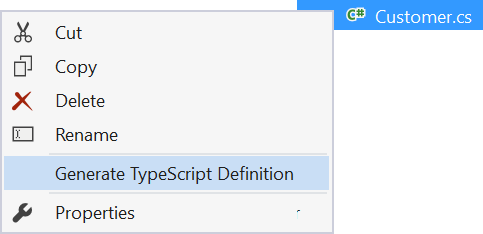
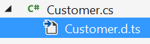
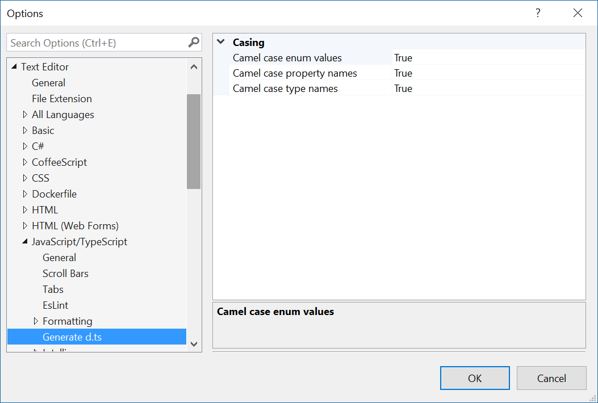

# TypeScript Definition Generator

[](https://ci.appveyor.com/project/madskristensen/typescriptdefinitiongenerator)

Download this extension from the [Marketplace](https://marketplace.visualstudio.com/vsgallery/7ef40759-8802-4b48-b4d6-3c250fb4916e)
or get the [CI build](http://vsixgallery.com/extension/cad7b20b-4b83-4ca6-bf24-ca36a494241c/).

---------------------------------------

Creates and synchronizes TypeScript Definition files (d.ts) from C#/VB model classes to build strongly typed web application where the server- and client-side models are in sync. Works on all .NET project types

See the [change log](CHANGELOG.md) for changes and road map.

## From C# to .d.ts file
This extension will automatically generate .d.ts files from any C#/VB file you specify. It will turn the following C# class into a TypeScript interface.

```csharp
class Customer
{
    public int Id { get; set; }
    public string Name { get; set; }
    public IEnumerable<string> Tags { get; set; }
}
```

Becomes this .d.ts file:

```typescript
declare module server {
	interface customer {
		id: number;
		name: string;
		tags: string[];
	}
}
```

The generated .d.ts file can then be consumed from your own TypeScript files by referencing `server.<typeName>` interfaces.

## Generate d.ts file from C#/VB
To generate a .d.ts file, right-click any .cs or .vb file and select **Generate TypeScript Definition**.



A .d.ts file is created and nested under the parent C#/VB file.



Every time the C#/VB file is modified and saved, the content of the .d.ts file is updated to reflect the changes.

## Settings
Configure this extension from the **Tools -> Options** dialog.



## Contribute
Check out the [contribution guidelines](.github/CONTRIBUTING.md)
if you want to contribute to this project.

For cloning and building this project yourself, make sure
to install the
[Extensibility Tools 2015](https://visualstudiogallery.msdn.microsoft.com/ab39a092-1343-46e2-b0f1-6a3f91155aa6)
extension for Visual Studio which enables some features
used by this project.

## License
[Apache 2.0](LICENSE)